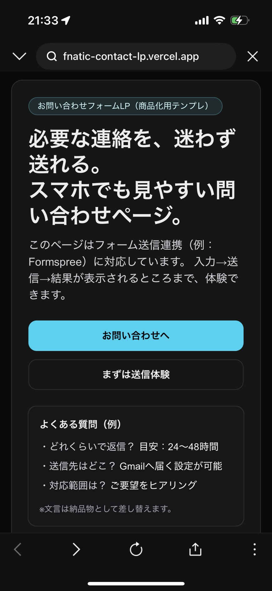
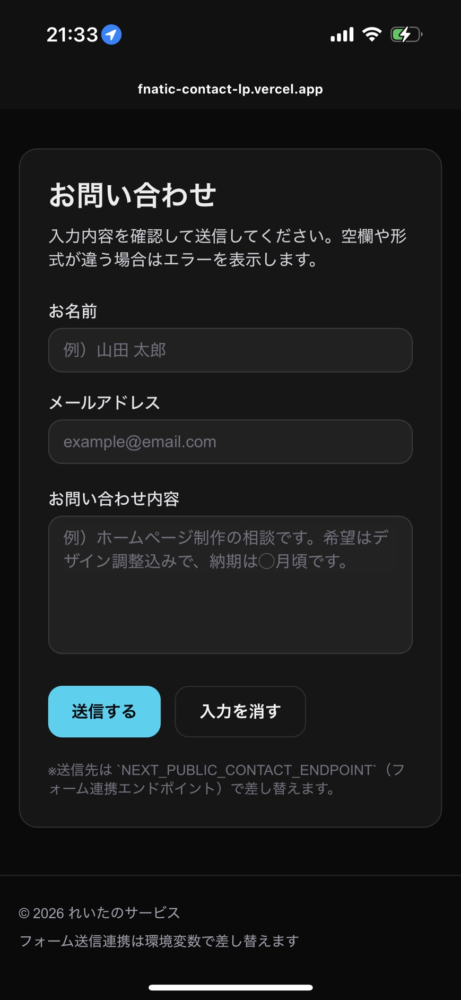

# fnatic-contact-lp（問い合わせLP）

## 公開URL
- https://fnatic-contact-lp.vercel.app

## このLPでできること
- スマホでも見やすい問い合わせフォームLP
- 入力チェック付き（空欄、メール形式、500文字以内）
- 送信結果の表示
  - 成功: `送信しました。ご確認ください。`

## 使い方
1. `/contact` を開く
2. `お名前` / `メールアドレス` / `お問い合わせ内容` を入力
3. `送信する` を押す
4. 送信結果（成功/失敗）が表示されることを確認

## 送信先エンドポイント設定
フォームの送信先は `NEXT_PUBLIC_CONTACT_ENDPOINT`（フォーム連携エンドポイント）です。
`fnatic-contact-lp/components/ContactForm.js` で参照しています。

ローカル開発では、プロジェクト直下に `.env.local` を作成して次を設定してください。

```env
NEXT_PUBLIC_CONTACT_ENDPOINT=https://example.formspree.io/f/xxxx
```

設定後は、開発サーバを再起動してください。

## スクリーンショット
下の3枚を `fnatic-contact-lp/screenshots/` に配置し、次のファイル名で管理してください。

- PC: `screenshots/contact-pc.jpg`
- スマホ: `screenshots/contact-mobile.jpg`
- 送信成功: `screenshots/contact-submit-success.png`





## 開発
```bash
npm install
npm run dev
```

## デプロイ
Vercel へはこのまま Import してデプロイ可能です。

- Vercel redeploy test: 2026-03-24